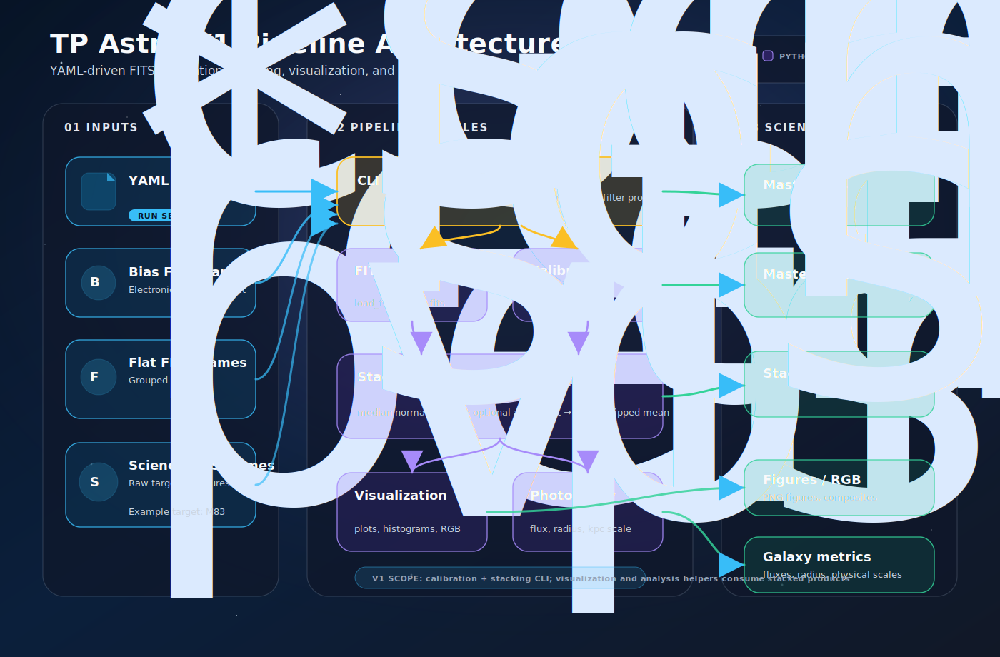

# TP Astro: FITS Calibration and Galaxy Analysis Pipeline

TP Astro is a compact, test-covered Python project for reducing astronomical FITS images and extracting first-pass science products from galaxy observations. The V1 pipeline turns raw science frames, bias frames, and filter-specific flats into calibrated and stacked FITS images, then supports visualization, RGB compositing, aperture photometry, effective-radius estimates, and physical-scale conversions.




## Scientific motivation

Deep-sky images contain both astronomical signal and instrument signatures. Bias frames characterize electronic offsets, flat fields characterize pixel-to-pixel and optical-response variations, and multiple science exposures improve signal-to-noise when aligned and stacked. This project packages that workflow into reusable helpers and a YAML-driven command-line interface so the same reduction steps can be inspected, tested, and repeated for targets such as M83.

The scientific goal of V1 is to provide a transparent teaching and portfolio pipeline that connects detector calibration to measurable galaxy properties: cleaned images, stacked filter products, RGB figures, aperture fluxes, effective radii, and angular-to-physical size estimates.

## Features

- **FITS I/O helpers** for loading primary-HDU image data and preserving headers when writing derived products.
- **Calibration helpers** for master-bias creation, normalized master-flat creation, and science-frame calibration.
- **Stacking and alignment helpers** for calibrated-unit stacking by default, optional legacy median normalization, optional `astroalign` registration, sigma clipping, and mean stacking.
- **YAML-driven CLI pipeline** that validates inputs and writes master calibration products plus stacked science images.
- **Calibration QC diagnostics** for per-frame bias statistics, bias ADU-regime warnings, flat exposure-time linearity curves, saturation checks, and CSV/PNG reports before master-flat stacking.
- **Diagnostics helpers** for calibration and stacking pixel-distribution histograms, robust finite-pixel statistics, reproducible frame sampling, and CSV diagnostics reports.
- **Visualization and enhancement helpers** for percentile scaling, single-image plots, histograms, before/after comparisons, simple RGB composites, display-only RGB presets, DS9-like zscale limits, RGB background neutralization/color balancing, adaptive full-frame versus crop-local contrast, linear/squared/cubed/sqrt/log/asinh/gamma display scales, Gaussian smoothing, unsharp masking, masked unsharp masking, and galaxy-centered crop products.
- **Photometry and galaxy-analysis helpers** for circular aperture fluxes, growth curves, effective radius estimates, distance modulus, absolute magnitude conversion, and pixel-to-kpc conversion.
- **Tests** covering calibration math, stacking behavior, visualization utilities, photometry utilities, and CLI config validation.

## Repository structure

```text
.
├── configs/                 # Example YAML pipeline configurations
│   ├── m83_example.yaml
│   └── m83_explicit_example.yaml
├── docs/                    # Project architecture and design documentation
│   └── architecture.md
├── doc/                     # Original teaching notebooks, PDFs, and legacy processing notes
├── Images/                  # Reference figures and example astronomy images
├── notebooks/               # Exploratory notebooks
├── scripts/                 # Command-line entry points
│   ├── run_calibration.py
│   ├── make_demo_figures.py
│   └── generate_object_report.py
├── src/astro_image_lab/     # Reusable package modules
│   ├── calibration.py
│   ├── diagnostics.py
│   ├── enhancement.py
│   ├── io.py
│   ├── photometry.py
│   ├── stacking.py
│   └── visualization.py
├── tests/                   # Pytest suite
├── environment.yml          # Conda environment definition
├── requirements.txt         # Pip dependency list
└── README.md
```

## Installation

### Option A: pip and virtualenv

```bash
python -m venv .venv
source .venv/bin/activate
python -m pip install --upgrade pip
python -m pip install -r requirements.txt
```

The repository currently uses a source-checkout layout. Scripts add `src/` to `sys.path` when needed, and tests do the same. For interactive notebooks or ad-hoc Python sessions, either run from the repository root or export:

```bash
export PYTHONPATH="$PWD/src:${PYTHONPATH}"
```

### Option B: conda

```bash
conda env create -f environment.yml
conda activate tp-astro
```

## Usage example

Create one YAML config per observed object. The compact example `configs/m83_example.yaml` needs only the object name, data root, and filters; `scripts/run_calibration.py` discovers FITS inputs from the standard object directory layout.

```bash
python scripts/run_calibration.py --config configs/m83_example.yaml
```

Recommended V2 review workflow after calibration:

```bash
python scripts/make_demo_figures.py --object M83 --preset deep_sky
python scripts/make_demo_figures.py --object M83 --preset galaxy_detail --crop-center 2120 2060 --crop-size 1400
python scripts/make_demo_figures.py --object M83 --preset galaxy_detail --crop-center 2120 2060 --crop-size 1400 --convolution masked_unsharp
python scripts/generate_object_report.py --object M83
```

Compact config mode looks like this:

```yaml
object_name: M83
data_root: data
filters:
  - red
  - green
  - blue
stacking:
  normalize_before_stack: false
diagnostics:
  enabled: true
  random_seed: 42
  bins: 100
  lower_percentile: 0.5
  upper_percentile: 99.5
  max_pixels: 1000000
calibration_qc:
  enabled: true
  bias:
    enabled: true
    group_tolerance_adu: 5.0
    reject_outliers: false
  flats:
    enabled: true
    linear_fit_threshold_seconds: 4.0
    saturation_adu: null
    max_mean_fraction_of_saturation: 0.8
    reject_non_linear: false
```

The inferred local data layout is:

```text
data/<OBJECT_NAME>/
├── raw/
│   └── <filter>/
│       └── *.{fits,fit,fts}
├── calibration/
│   ├── bias/
│   │   └── *.{fits,fit,fts}
│   └── flats/
│       └── <filter>/
│           └── *.{fits,fit,fts}
├── calibrated/
├── stacked/
├── figures/
└── analysis/
```

The CLI accepts `.fits`, `.fit`, and `.fts` filenames case-insensitively, sorts discovered lists for reproducibility, and creates output directories when needed. The default `input_mode: raw` preserves the original behavior: bias, flat, and raw science frames are discovered from the layout above, calibrated, optionally aligned, and stacked. If `calibration_qc.enabled` or `diagnostics.enabled` is true, the raw-mode pipeline also writes diagnostic products under `data/<OBJECT_NAME>/analysis/diagnostics/`. For each configured science filter, raw mode writes:

- `master_bias.fits` to `data/<OBJECT_NAME>/calibrated/`
- `master_flat_<filter>.fits` to `data/<OBJECT_NAME>/calibrated/`
- `stacked_<filter>.fits` to `data/<OBJECT_NAME>/stacked/`
- `alignment_report.csv` to `data/<OBJECT_NAME>/analysis/`
- When channel alignment is enabled, `stacked/aligned_channels/stacked_<filter>_aligned.fits` and `analysis/channel_alignment_report.csv`
- When calibration QC is enabled, `analysis/diagnostics/bias_frame_statistics.csv`, `flat_frame_statistics.csv`, `calibration_qc_warnings.txt`, `bias_frame_mean_median_distribution.png`, and one `flat_<filter>_linearity_curve.png` per filter
- When diagnostics are enabled, `analysis/diagnostics/pixel_statistics.csv` and histogram PNGs for random bias/master-bias, flat/master-flat, science calibration, optional stacking normalization, and stacking comparisons


### Processing already-calibrated data

When the science frames are already bias/flat corrected, set `input_mode: precalibrated`. This mode skips master-bias creation, master-flat creation, science calibration, and calibration-frame QC. It uses the already-calibrated arrays directly as stack inputs while preserving existing frame alignment, `stacking.normalize_before_stack`, sigma-clipped stacking, channel alignment, visualization, and reporting behavior.

Compact precalibrated configs discover supported FITS files from `data/<OBJECT_NAME>/calibrated/<filter>/`:

```yaml
object_name: M83
data_root: data
input_mode: precalibrated
filters:
  - red
  - green
  - blue
alignment:
  enabled: true
  method: astroalign
  min_area: 12
  fail_policy: raise
channel_alignment:
  enabled: true
  reference_filter: green
output_dirs:
  calibrated: data/M83/calibrated
  stacked: data/M83/stacked
  figures: data/M83/figures
  analysis: data/M83/analysis
```

You can also bypass directory discovery with explicit already-calibrated file lists:

```yaml
input_mode: precalibrated
precalibrated_files:
  red:
    - path/to/red_001.fits
    - path/to/red_002.fit
  green:
    - path/to/green_001.fts
output_dirs:
  calibrated: data/M83/calibrated
  stacked: data/M83/stacked
  figures: data/M83/figures
  analysis: data/M83/analysis
```

Precalibrated mode writes `stacked_<filter>.fits` to the configured stacked directory, always writes `alignment_report.csv`, and still writes `channel_alignment_report.csv` plus `stacked/aligned_channels/stacked_<filter>_aligned.fits` when channel alignment is enabled. It does not require or read `bias_files`, `flat_files`, `calibration/bias/`, or `calibration/flats/`, and it does not write `master_bias.fits` or `master_flat_<filter>.fits`.


### Stacking scale control

The scientific default is to preserve calibrated pixel units in `stacked_<filter>.fits`:

```yaml
stacking:
  normalize_before_stack: false
```

With this setting, science frames are calibrated and then stacked without median-normalizing their pixel values. If frame alignment is enabled, normalized copies may still be used internally to detect sources and estimate the registration transform, but that transform is applied to the calibrated image before stacking so the output remains in calibrated units.

Set `stacking.normalize_before_stack: true` only to reproduce the older notebook/script behavior where each calibrated science frame is divided by its median before stacking; this creates final stacks centered around roughly 1 rather than calibrated ADU-like units.

### Calibration QC and diagnostics

`calibration_qc` is separate from the later `diagnostics` histogram suite. When `calibration_qc.enabled: true`, `scripts/run_calibration.py` creates `data/<OBJECT_NAME>/analysis/diagnostics/` before master flats are built and writes:

- `bias_frame_statistics.csv`, listing per-bias `file`, finite-pixel statistics, `shape`, and FITS metadata (`EXPTIME`, `GAIN`, `OFFSET`, `CCD-TEMP`/`TEMP`, and `DATE-OBS`) when present.
- `bias_frame_mean_median_distribution.png`, plotting per-bias-frame mean/median ADU against frame index/file name with horizontal master-bias mean/median reference lines.
- `flat_frame_statistics.csv`, listing per-flat `file`, `filter`, `EXPTIME`, finite-pixel statistics, and `shape`.
- `flat_<filter>_linearity_curve.png`, with all flat mean ADU values versus `EXPTIME` and a NumPy linear fit over `EXPTIME <= calibration_qc.flats.linear_fit_threshold_seconds`.
- `calibration_qc_warnings.txt`, including bias ADU-regime warnings, missing/insufficient flat `EXPTIME` warnings, saturation-threshold warnings when `saturation_adu` is configured, and max mean/p99 ADU reports when saturation is not configured.

By default calibration QC is diagnostic-only: `reject_outliers: false` retains all bias frames, and `reject_non_linear: false` retains all flats for master-flat creation. Set either rejection flag explicitly only after reviewing the QC outputs.

The optional `diagnostics` config section remains observational only: it does not modify calibration, alignment, stacking, or RGB enhancement algorithms. When enabled after the calibration/stacking products exist, it writes:

- `bias_random_vs_master_hist.png`, comparing one deterministic raw bias frame with `master_bias.fits`.
- `flat_<filter>_random_vs_master_hist.png`, comparing one deterministic bias-subtracted, median-normalized flat with `master_flat_<filter>.fits`.
- `science_<filter>_before_after_calibration_hist.png`, comparing one deterministic raw science frame with the same frame after calibration.
- `science_<filter>_calibrated_vs_normalized_hist.png` when `stacking.normalize_before_stack: true`, comparing the calibrated sample science frame with its median-normalized copy.
- `science_<filter>_calibrated_vs_stacked_hist.png`, comparing that calibrated science frame with `stacked_<filter>.fits` and stating whether median normalization was enabled during stacking.
- `pixel_statistics.csv`, with `stage`, `filter`, `label`, `source_path`, `mean`, `median`, `std`, `min`, `max`, `p1`, `p5`, `p95`, `p99`, `finite_fraction`, and `n_finite` for every plotted array.

Histogram plots use finite pixels only, ignore `NaN` and `Inf`, sample at most `diagnostics.max_pixels` pixels per image using `diagnostics.random_seed`, set x-limits from the configured lower/upper percentiles across both compared distributions, set y-limits from counts inside that x-range, overlay the distributions, and draw dashed vertical mean lines.

Generate PNG demo figures from those stacked FITS products with:

```bash
python scripts/make_demo_figures.py --object M83
```

By default, the demo-figure script discovers supported FITS files in `data/M83/stacked/`, keeps files whose stems start with `stacked_`, creates `data/M83/figures/` if needed, and prints every PNG path it writes. It saves one channel preview and one finite-pixel histogram per discovered filter:

- `stacked_<filter>.png` to `data/<OBJECT_NAME>/figures/`
- `histogram_<filter>.png` to `data/<OBJECT_NAME>/figures/`

Demo histograms ignore NaN/Inf pixels and automatically frame the useful finite-pixel distribution with robust percentile x-axis bounds (`--hist-lower-percentile`, `--hist-upper-percentile`, and `--hist-bins`; defaults `0.5`, `99.5`, and `100`) so saturated stars, cosmic rays, and extreme outliers do not dominate the axes.

When `stacked_red`, `stacked_green`, and `stacked_blue` files with supported FITS extensions are all available in the selected inputs, it also writes `rgb_composite.png` using the package RGB visualization helper. Use `--data-root` for a different object-layout root, or `--filters blue green red` to render a specific filter subset without rerunning calibration.

For display-quality RGB previews, use named presets. The recommended full-frame output is `deep_sky`; it keeps the backward-compatible `rgb_composite.png` and adds `rgb_composite_deep_sky.png` with zscale limits, a cubed display scale, background equalization, and background-based color balance:

```bash
python scripts/make_demo_figures.py --object M83 --preset deep_sky
```

For cropped galaxy detail, use `galaxy_detail`. This preset keeps color stable by estimating background/color balance from the full RGB frame, but estimates zscale/percentile display limits from the requested crop so zoomed-in structure has stronger local definition:

```bash
python scripts/make_demo_figures.py --object M83 --preset galaxy_detail \
  --crop-center 2120 2060 --crop-size 1400
```

Convolution modes are optional advanced experiments rather than preset defaults. The default `galaxy_detail` render writes `rgb_crop_galaxy_detail.png` with no convolution. Pass `--convolution masked_unsharp` explicitly when you want a method-labeled `rgb_crop_galaxy_detail_masked_unsharp.png` comparison:

```bash
python scripts/make_demo_figures.py --object M83 --preset galaxy_detail \
  --crop-center 2120 2060 --crop-size 1400 --convolution masked_unsharp
```

Primary visualization controls are `--object`, `--data-root`, `--filters`, `--preset diagnostic|natural|deep_sky|galaxy_detail`, `--crop-center X Y`, `--crop-center-origin 0|1`, `--crop-size SIZE`, `--convolution none|smooth|unsharp|masked_unsharp`, `--mask-percentile`, `--mask-softness`, and the histogram controls `--hist-lower-percentile`, `--hist-upper-percentile`, and `--hist-bins`. Crop centers are supplied as display-style `X Y` coordinates (x=column, y=row); the code converts those to NumPy row/column indexing and prints the interpreted center and clipped crop bounds.

Preset behavior is:

- `diagnostic`: zscale + linear, no background neutralization, no color balance, full-frame contrast.
- `natural`: zscale + squared, background equalization, partial background color balance, full-frame contrast.
- `deep_sky`: zscale + cubed, background equalization, full background color balance, full-frame contrast.
- `galaxy_detail`: zscale + cubed, background equalization, gentle background color balance, crop-local contrast, full-frame balance, no default convolution; crop recommended.

All RGB preset, crop, smoothing, unsharp, and masked-unsharp outputs are PNG-only visualization products. They load calibrated/stacked FITS arrays into memory but do not modify calibrated, stacked, or aligned FITS science data.

Advanced overrides remain available but are intentionally secondary to the presets: `--rgb-limits zscale|percentile`, `--rgb-scale linear|squared|cubed|sqrt|log|asinh|gamma`, `--background-neutralization none|subtract|equalize`, `--background-percentile`, `--color-balance none|background|median|max`, `--color-balance-strength`, `--channel-scales R G B`, `--smooth-sigma`, `--unsharp-sigma`, `--unsharp-amount`, `--mask-percentile`, `--mask-softness`, `--zscale-contrast`, `--lower`, `--upper`, `--gamma`, `--stretch`, `--contrast-region full|crop`, and `--balance-region full|crop`. The older `--ds9like`, manual named-scale outputs, and `--galaxy-detail-grid` comparison output remain available as explicit advanced/debug tools; large comparison grids are not generated unless requested.

Generate a compact object-level Markdown report after running calibration and visualization:

```bash
python scripts/generate_object_report.py --object M83
python scripts/generate_object_report.py --object M83 --data-root data
```

The report is written to `data/<OBJECT_NAME>/analysis/report.md` and summarizes the object layout, stacked and aligned FITS products, key visualization PNGs, calibration QC warnings/statistics, alignment status counts, diagnostic plots, and suggested manual checks. The optional summary-sheet concept is tracked as a TODO; the current implementation intentionally keeps reporting portable and Markdown-only.


Alignment remains enabled by default and can still be controlled with the legacy top-level `align: true` or `align: false` flag. New configs can use an `alignment` block for diagnostics and tuning; when `alignment.enabled` is present, it overrides the legacy `align` value. The default settings preserve the previous behavior:

```yaml
alignment:
  enabled: true
  method: astroalign
  min_area: 12
  detection_sigma: null
  reference: first
  fail_policy: raise
```

`min_area` is forwarded to `astroalign.register`. `fail_policy: raise` stops on a registration failure, while `fail_policy: skip` records the failed science frame in the report and stacks the remaining usable frames. The alignment report records one row per science frame with the filter, file path, frame index, status (`reference`, `aligned`, `skipped`, or `failed`), error message, method, and `min_area`.


Channel alignment is a second, optional alignment stage that runs after per-filter stacking. Frame alignment registers science frames within one filter; channel alignment registers the final `stacked_red`, `stacked_green`, and `stacked_blue` products to a common reference before RGB composition. It is disabled when the `channel_alignment` section is absent. Enable it with:

```yaml
channel_alignment:
  enabled: true
  reference_filter: green
  method: astroalign
  min_area: 12
  fail_policy: raise
```

The reference filter defaults to green when green is available, otherwise the first available filter is used. Successful outputs are written under `data/<OBJECT_NAME>/stacked/aligned_channels/` as `stacked_<filter>_aligned.fits`, and `channel_alignment_report.csv` records each channel status (`reference`, `aligned`, or `failed`). `scripts/make_demo_figures.py` still renders per-filter previews from the regular stacked products, but its RGB composite prefers aligned channel files when they exist and falls back to regular `stacked_<filter>.fits` files otherwise; the CLI prints the RGB source paths it used.

Explicit raw config mode is still supported for custom file selections. Use `configs/m83_explicit_example.yaml` as a template with `bias_files`, `flat_files`, `science_files`, and optional `output_dirs`. For precalibrated data, use `input_mode: precalibrated` with `precalibrated_files`. For backward compatibility, older configs can omit `output_dirs` and keep using `output_dir`; in that case all generated FITS outputs are written to the single legacy directory.

## Testing

Run the full test suite from the repository root:

```bash
pytest -q
```

## Current V2.5 status

V2.5 is a working, modular baseline for object-based astronomy-image reduction experiments:

- FITS I/O, calibration, stacking/alignment, visualization, display-only enhancement, photometry, and galaxy-analysis helpers are implemented under `src/astro_image_lab/`.
- The command-line calibration pipeline is driven by YAML configuration, performs input validation before reading FITS data, writes alignment diagnostics for each science frame, and can optionally align final stacked channels for RGB composition.
- The test suite covers the core numerical behavior and CLI validation paths.
- The example M83 configuration documents the object-based `data/M83/` layout, but the raw FITS data are not committed to the repository.
- The pipeline is intentionally lightweight and explicit, favoring readable scientific steps over a large framework.

## Roadmap for V2

- Add packaging metadata (`pyproject.toml`) and an installable console script.
- Expand configuration schemas for dark frames, exposure-time normalization, WCS-aware alignment, and richer output naming.
- Add end-to-end integration tests using small synthetic FITS fixtures.
- Generate automated quality-control reports with image previews, histograms, rejection statistics, and provenance metadata.
- Improve photometry with background annuli, uncertainty propagation, zero-point handling, and optional `photutils` integration.
- Add WCS-aware galaxy analysis, surface-brightness profiles, and calibrated physical measurements.
- Provide reproducible example data download instructions or scripts for public demonstration datasets.
