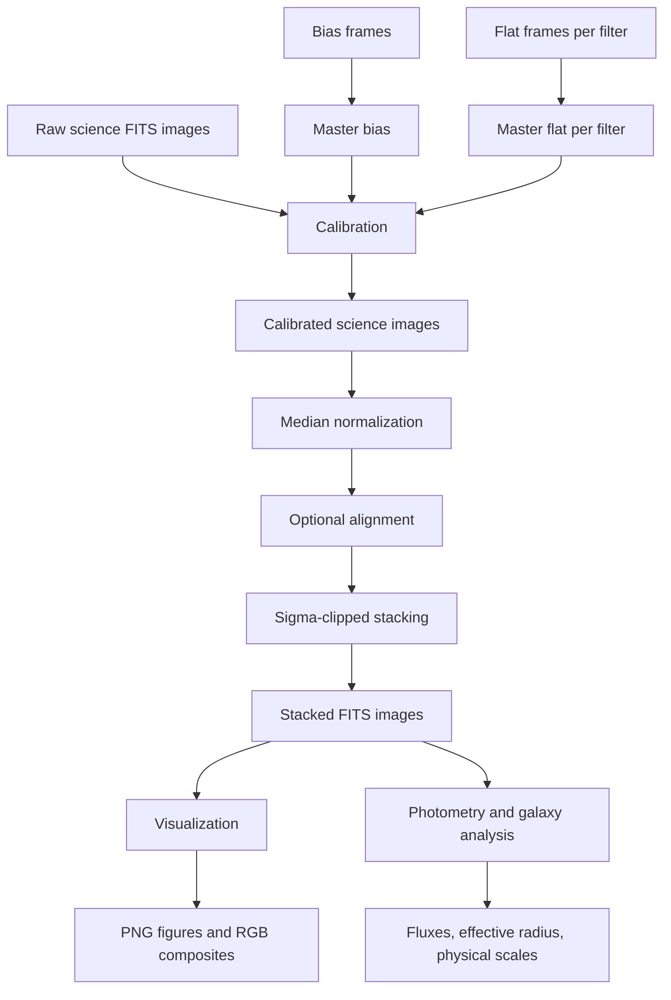

# TP Astro Architecture

This document describes the V2.1 scientific workflow and software architecture for the TP Astro FITS calibration and galaxy-analysis pipeline.


The static SVG above is the main visual overview for portfolio and README use. The Mermaid diagrams below remain as text-based technical references.

## Scientific pipeline



## Software architecture

```mermaid
flowchart LR
    CFG[configs/*.yaml] --> CLI[scripts/run_calibration.py]
    CLI --> IO[astro_image_lab.io]
    CLI --> CAL[astro_image_lab.calibration]
    CLI --> STACK[astro_image_lab.stacking]
    CAL --> IO
    STACK --> IO
    STACK --> CAL
    STACK -. optional .-> ALIGN[astroalign]
    STACK -. preferred .-> ASTROPY[astropy.stats.sigma_clip]
    IO -. FITS backend .-> FITS[astropy.io.fits]
    FITS --> OUT[(data/<OBJECT_NAME>/{calibrated,stacked})]
    OUT --> VIZ[astro_image_lab.visualization]
    OUT --> PHOTO[astro_image_lab.photometry]
    VIZ --> FIGS[(PNG figures / RGB arrays)]
    PHOTO --> MEAS[(Fluxes / radii / kpc scales)]
    TESTS[tests/] --> CLI
    TESTS --> IO
    TESTS --> CAL
    TESTS --> STACK
    TESTS --> VIZ
    TESTS --> PHOTO
```


## Object-based data layout

V2.1 organizes local data by observed object and uses one YAML config per object. For M83, the recommended directory structure is:

```text
data/M83/
├── raw/
├── calibration/
│   ├── bias/
│   └── flats/
├── calibrated/
├── stacked/
├── figures/
└── analysis/
```

The `output_dirs` mapping in the object config points to the writable products directories. `master_bias.fits` and `master_flat_<filter>.fits` are written to `output_dirs.calibrated`; `stacked_<filter>.fits` is written to `output_dirs.stacked`; `output_dirs.figures` and `output_dirs.analysis` are created for downstream visualization and analysis products. Older V1 configs without `output_dirs` remain supported by setting `output_dir`, which is used for all generated FITS files.

## Module responsibility table

| Module or path | Responsibility | Main outputs |
| --- | --- | --- |
| `scripts/run_calibration.py` | Command-line entry point; loads one object YAML config, validates required fields, checks inputs, creates output directories, orchestrates master calibration products and stacked outputs. | `master_bias.fits`, `master_flat_<filter>.fits`, `stacked_<filter>.fits` |
| `src/astro_image_lab/io.py` | FITS I/O boundary; reads primary-HDU image data and headers, writes data/header pairs back to FITS. | NumPy-like image arrays, FITS headers, FITS files |
| `src/astro_image_lab/calibration.py` | Builds master bias and master flats; applies `(science - master_bias) / master_flat` calibration. | Master calibration arrays and calibrated science arrays |
| `src/astro_image_lab/stacking.py` | Median-normalizes calibrated science images, optionally registers images with `astroalign`, sigma-clips stacks, and averages surviving pixels. | Stacked `float32` science images |
| `src/astro_image_lab/visualization.py` | Percentile scaling and Matplotlib-based inspection plots; RGB array creation from stacked channels. | Figures, PNG files, RGB arrays |
| `src/astro_image_lab/photometry.py` | Lightweight aperture photometry and galaxy-analysis math implemented with NumPy. | Aperture fluxes, growth curves, effective radius, magnitudes, kpc scales |
| `configs/m83_example.yaml` | Example declarative pipeline configuration for M83-style red/green/blue processing. | Runtime parameters and input/output paths |
| `tests/` | Regression tests for numerical helpers, CLI validation, and plotting behavior. | Test confidence for V1 behavior |

## Input/output table

| Stage | Inputs | Outputs | Notes |
| --- | --- | --- | --- |
| Configuration | One object YAML file with `object_name`, `bias_files`, `flat_files`, `science_files`, `output_dirs`, and optional `align`, `sigma`, `maxiters`. Legacy configs may use `output_dir` instead of `output_dirs`. | Validated Python paths and options. | Filters in `flat_files` and `science_files` must match. |
| Bias creation | Bias FITS files. | `output_dirs.calibrated/master_bias.fits` and in-memory master-bias array. | Default combine method is per-pixel median. Legacy `output_dir` configs write this file to the single legacy directory. |
| Flat creation | Per-filter flat FITS files and master bias. | `output_dirs.calibrated/master_flat_<filter>.fits` and in-memory normalized master-flat arrays. | Each flat is bias-subtracted and median-normalized before equal-weight averaging. Legacy `output_dir` configs write these files to the single legacy directory. |
| Science calibration | Per-filter raw science FITS files, master bias, matching master flat. | In-memory calibrated science arrays. | Invalid or zero flat pixels become `NaN` downstream. |
| Normalization and alignment | Calibrated science arrays; optional `astroalign` registration. | Normalized and optionally registered stack cube. | The first science image is retained as the alignment reference. |
| Sigma-clipped stacking | Stack cube, sigma threshold, maximum iterations. | `output_dirs.stacked/stacked_<filter>.fits` images. | Uses Astropy sigma clipping when available, with a NumPy fallback. Legacy `output_dir` configs write these files to the single legacy directory. |
| Visualization | Stacked FITS data or arrays. | Inspection figures, histograms, comparisons, RGB composites. | Plot helpers can save PNGs when an output path is supplied. |
| Photometry and galaxy analysis | Stacked image arrays, aperture center/radii, background estimate, distance and pixel scale metadata. | Fluxes, growth curves, effective radius, absolute magnitudes, physical sizes. | V1 provides lightweight NumPy calculations rather than a full photometry framework. |

## Data flow through the system

1. Each observed target has its own YAML file. The config describes the object name, where raw calibration and science FITS files live, how filters are grouped, where object-specific outputs should be written, and which stacking parameters should be used.
2. The CLI validates the config before importing heavier scientific helpers. It ensures the required fields exist, either `output_dirs` or legacy `output_dir` is configured, the flat/science filter sets match, scalar options have sensible types, and all input files are present. It creates all configured output directories when they are missing.
3. Bias frames are loaded through the FITS I/O layer and combined into a master bias. The CLI writes that product with the header from the first bias frame into `output_dirs.calibrated` or the legacy `output_dir`.
4. For each filter, flat frames are loaded, bias-subtracted, normalized by their median response, averaged, renormalized, and written as a filter-specific master flat into `output_dirs.calibrated` or the legacy `output_dir`.
5. For the same filter, each science frame is loaded, calibrated with the master bias and matching master flat, then normalized by its median to place images on a common relative scale.
6. If alignment is enabled, the first normalized science image is used as the reference and later images are registered to it with `astroalign`. If alignment is disabled, images are stacked in their original pixel coordinates.
7. The normalized image cube is sigma-clipped along the exposure axis and averaged into a final stacked image, which is saved as `stacked_<filter>.fits` in `output_dirs.stacked` or the legacy `output_dir`.
8. Stacked products can then feed visualization helpers for review figures and RGB composites, or photometry helpers for aperture fluxes, growth curves, effective-radius estimates, and angular-to-physical size conversions.
9. Tests exercise the scientific assumptions and guard against regressions in calibration formulas, stacking behavior, plotting helpers, photometry math, and CLI validation.
