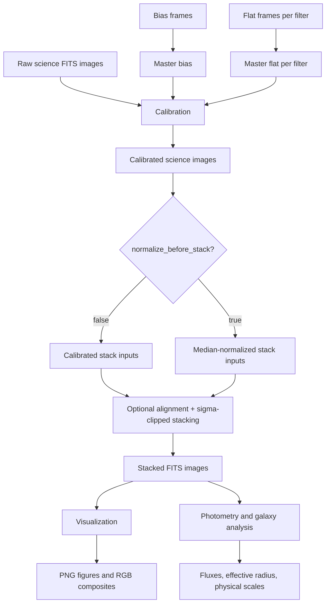

# TP Astro Architecture

This document describes the V2.6 scientific workflow and software architecture for the TP Astro FITS calibration and galaxy-analysis pipeline.


The static SVG above is the main visual overview for portfolio and README use. The Mermaid diagrams below remain as text-based technical references.

## Scientific pipeline



## Software architecture

```mermaid
flowchart LR
    CFG[configs/*.yaml] --> CLI[scripts/run_calibration.py]
    CLI --> IO[astro_image_lab.io]
    CLI --> CAL[astro_image_lab.calibration]
    CLI --> STACK[astro_image_lab.stacking]
    CAL --> IO
    STACK --> IO
    STACK --> CAL
    STACK -. optional .-> ALIGN[astroalign]
    STACK -. preferred .-> ASTROPY[astropy.stats.sigma_clip]
    IO -. FITS backend .-> FITS[astropy.io.fits]
    FITS --> OUT[(data/<OBJECT_NAME>/{calibrated,stacked})]
    OUT --> VIZ[astro_image_lab.visualization]
    OUT --> PHOTO[astro_image_lab.photometry]
    VIZ --> FIGS[(PNG figures / RGB arrays)]
    PHOTO --> MEAS[(Fluxes / radii / kpc scales)]
    TESTS[tests/] --> CLI
    TESTS --> IO
    TESTS --> CAL
    TESTS --> STACK
    TESTS --> VIZ
    TESTS --> PHOTO
```


## Object-based data layout

V2.6 organizes local data by observed object and uses one YAML config per object. The compact config mode provides `object_name`, `data_root`, and `filters`, then the CLI discovers FITS inputs from this standard structure:

```text
data/M83/
├── raw/
│   ├── red/
│   │   └── *.{fits,fit,fts}
│   ├── green/
│   │   └── *.{fits,fit,fts}
│   └── blue/
│       └── *.{fits,fit,fts}
├── calibration/
│   ├── bias/
│   │   └── *.{fits,fit,fts}
│   └── flats/
│       ├── red/
│       │   └── *.{fits,fit,fts}
│       ├── green/
│       │   └── *.{fits,fit,fts}
│       └── blue/
│           └── *.{fits,fit,fts}
├── calibrated/
├── stacked/
├── figures/
└── analysis/
```

The CLI accepts `.fits`, `.fit`, and `.fts` files case-insensitively and sorts discovered lists for reproducibility. `input_mode` defaults to `raw`, which uses the original bias/flat/raw science layout. `input_mode: precalibrated` skips bias/flat discovery and calibration, then discovers already-calibrated science files from `data/<OBJECT_NAME>/calibrated/<filter>/` or from explicit `precalibrated_files`. Compact configs infer `output_dirs.calibrated`, `output_dirs.stacked`, `output_dirs.figures`, and `output_dirs.analysis` from `data_root/object_name`. Explicit `output_dirs` override those inferred directories; older V1 configs without `output_dirs` remain supported by setting `output_dir`, which is used for all generated FITS files. Raw mode writes `master_bias.fits` and `master_flat_<filter>.fits` to the calibrated directory, while both raw and precalibrated modes write `stacked_<filter>.fits` to the stacked directory.

## Module responsibility table

| Module or path | Responsibility | Main outputs |
| --- | --- | --- |
| `scripts/run_calibration.py` | Command-line entry point; loads one object YAML config, validates raw or precalibrated input modes, checks inputs, creates output directories, orchestrates optional master calibration products and stacked outputs. | Raw mode: `master_bias.fits`, `master_flat_<filter>.fits`, `stacked_<filter>.fits`; precalibrated mode: `stacked_<filter>.fits` |
| `scripts/make_demo_figures.py` | Post-pipeline demo-figure entry point; reads object-layout stacked FITS outputs, creates the figures directory, writes per-filter previews/histograms, prefers aligned RGB channels, and optionally writes preset, DS9-like, named-scale, crop, and galaxy-detail-grid PNG composites. | `stacked_<filter>.png`, `histogram_<filter>.png`, `rgb_composite.png`, `rgb_composite_<preset>.png`, `rgb_composite_ds9like.png`, `rgb_composite_<limits>_<scale>.png`, `rgb_crop_galaxy_detail.png`, `rgb_crop_<limits>_<scale>*.png`, `galaxy_detail_grid.png` |
| `src/astro_image_lab/io.py` | FITS I/O boundary; centralizes supported FITS extension checks and non-recursive file discovery, reads primary-HDU image data and headers, and writes data/header pairs back to FITS. | Sorted FITS path lists, NumPy-like image arrays, FITS headers, FITS files |
| `src/astro_image_lab/calibration.py` | Builds master bias and master flats; applies `(science - master_bias) / master_flat` calibration. | Master calibration arrays and calibrated science arrays |
| `src/astro_image_lab/stacking.py` | Calibrates raw science images or accepts already-calibrated images directly, optionally uses normalized copies for registration, optionally median-normalizes stack inputs, sigma-clips stacks, and averages surviving pixels. | Stacked `float32` science images |
| `src/astro_image_lab/visualization.py` | Percentile scaling and Matplotlib-based inspection plots; RGB array creation from stacked channels. | Figures, PNG files, RGB arrays |
| `src/astro_image_lab/enhancement.py` | Display-only post-processing helpers: zscale-like limits, percentile limits, RGB background neutralization, channel color balancing, display scales, raw-channel crops using `[x, y]` centers, Gaussian smoothing, unsharp masking, and processed RGB generation. | Normalized RGB arrays for PNG previews; no FITS products are modified. |
| `src/astro_image_lab/photometry.py` | Lightweight aperture photometry and galaxy-analysis math implemented with NumPy. | Aperture fluxes, growth curves, effective radius, magnitudes, kpc scales |
| `configs/m83_example.yaml` | Example declarative pipeline configuration for M83-style red/green/blue processing. | Runtime parameters and input/output paths |
| `tests/` | Regression tests for numerical helpers, CLI validation, and plotting behavior. | Test confidence for V1 behavior |

## Input/output table

| Stage | Inputs | Outputs | Notes |
| --- | --- | --- | --- |
| Configuration | Compact object YAML with `object_name`, `data_root`, `filters`, optional `input_mode`, and optional legacy `align`, `alignment`, `channel_alignment`, `stacking.normalize_before_stack`, `sigma`, `maxiters`; raw explicit YAML with `bias_files`, `flat_files`, `science_files`; or precalibrated explicit YAML with `precalibrated_files`. Legacy configs may use `output_dir`; explicit `output_dirs` can override inferred outputs. | Validated Python paths and options. | `input_mode` defaults to `raw`. Raw compact discovery requires standard per-filter raw and flat directories. Precalibrated compact discovery requires `calibrated/<filter>/` directories and does not require bias or flat inputs. The scientific stacking default preserves calibrated units. |
| Bias creation | Raw mode only: bias FITS files. | `output_dirs.calibrated/master_bias.fits` and in-memory master-bias array. | Skipped in precalibrated mode. Default combine method is per-pixel median. Legacy `output_dir` configs write this file to the single legacy directory. |
| Flat creation | Raw mode only: per-filter flat FITS files and master bias. | `output_dirs.calibrated/master_flat_<filter>.fits` and in-memory normalized master-flat arrays. | Skipped in precalibrated mode. Each flat is bias-subtracted and median-normalized before equal-weight averaging. Legacy `output_dir` configs write these files to the single legacy directory. |
| Science calibration | Raw mode: per-filter raw science FITS files, master bias, matching master flat. Precalibrated mode: already-calibrated FITS files. | In-memory calibrated science arrays used for stacking. | Precalibrated mode uses input arrays directly and applies no bias/flat correction. Invalid or zero flat pixels become `NaN` downstream only in raw mode. |
| Normalization and alignment | Calibrated science arrays from raw calibration or already-calibrated input files; optional `astroalign` registration. | Normalized and optionally registered stack cube plus CSV-ready alignment records. | The first science image is retained as the alignment reference. Alignment records capture filter, file path, index, status, errors, method, and `min_area`. |
| Sigma-clipped stacking | Stack cube, sigma threshold, maximum iterations. | `output_dirs.stacked/stacked_<filter>.fits` images. | Uses Astropy sigma clipping when available, with a NumPy fallback. By default (`stacking.normalize_before_stack: false`) the cube contains calibrated images in calibrated units; setting it to true preserves the old median-normalized behavior. Legacy `output_dir` configs write these files to the single legacy directory. |
| Calibration and stacking diagnostics | Raw mode only: raw bias/flat/science frames, all bias-frame statistics, master calibration arrays, calibrated sample science arrays, optional normalized sample science arrays, and stacked images. | `output_dirs.analysis/diagnostics/*.png`, `pixel_statistics.csv`, and `bias_frame_statistics.csv`. | Calibration-frame QC and calibration diagnostics are skipped in precalibrated mode because no bias/flat/raw science inputs are required. Raw-mode plots and CSVs are observational/debug outputs and do not alter calibration, alignment, stacking, or RGB enhancement behavior. |
| Channel alignment | Final stacked filter images; optional `channel_alignment` config. | `output_dirs.stacked/aligned_channels/stacked_<filter>_aligned.fits` and `output_dirs.analysis/channel_alignment_report.csv`. | Disabled when `channel_alignment` is absent. When enabled, green is the default reference if available; otherwise the first filter is used. |
| Visualization and display enhancement | Stacked FITS data or arrays. | Inspection figures, histograms, comparisons, simple RGB composites, optional enhanced RGB PNG previews, preset composites (`diagnostic`, `natural`, `deep_sky`, `galaxy_detail`), DS9-like zscale/squared composites, named display-scale composites, crop composites, optional masked-unsharp crop products, and `galaxy_detail_grid.png`. | Plot helpers can save PNGs when an output path is supplied. `scripts/make_demo_figures.py` provides the object-layout CLI for discovering supported FITS files in `data/<OBJECT_NAME>/stacked/` whose stems start with `stacked_` and rendering them into `data/<OBJECT_NAME>/figures/`. RGB composition prefers `stacked/aligned_channels/stacked_<filter>_aligned.fits` when present and falls back to regular stacked files. The recommended full-frame workflow is `--preset deep_sky`, which writes `rgb_composite_deep_sky.png` with zscale limits, a cubed display scale, background equalization, and background color balance. Presets set defaults; advanced options such as `--rgb-limits`, `--rgb-scale`, `--background-neutralization`, `--color-balance`, `--color-balance-strength`, `--channel-scales`, `--balance-region`, `--contrast-region`, `--convolution`, `--smooth-sigma`, `--unsharp-sigma`, `--unsharp-amount`, `--mask-percentile`, and `--mask-softness` override those defaults. Galaxy crop products use DS9-style `--crop-center X Y` (x=column, y=row) with zero-based coordinates by default or `--crop-center-origin 1` for one-based inputs; the CLI logs the requested X,Y center, interpreted NumPy row,col, crop bounds, and whether background/color balance was estimated from the full frame or crop. Galaxy-detail outputs default to crop-local contrast, full-frame background/color estimates, a cubed scale, and no convolution; smoothing/unsharp/masked-unsharp modes remain optional advanced PNG-only experiments. All of these are PNG-only visualization products and never modify calibrated or stacked FITS data. |
| Object reporting | Stacked/aligned FITS paths, visualization PNGs, calibration QC text/CSVs, alignment CSVs, and diagnostic PNGs. | `data/<OBJECT_NAME>/analysis/report.md`. | `scripts/generate_object_report.py` gathers post-run outputs into a compact Markdown report. Data flow: stacked/aligned FITS → `make_demo_figures.py` → PNG outputs; diagnostics/QC CSVs and text warnings → `generate_object_report.py` → `report.md`. It summarizes warning lines and alignment/channel-alignment status counts when the source files are present. |
| Photometry and galaxy analysis | Stacked image arrays, aperture center/radii, background estimate, distance and pixel scale metadata. | Fluxes, growth curves, effective radius, absolute magnitudes, physical sizes. | V1 provides lightweight NumPy calculations rather than a full photometry framework. |

## Data flow through the system

1. Each observed target has its own YAML file. Compact configs describe the object name, data root, filters, input mode, and stacking parameters; raw explicit configs can list every bias, flat, and science FITS path, while precalibrated explicit configs can list `precalibrated_files` by filter.
2. The CLI validates the config before importing heavier scientific helpers. In raw compact mode it checks bias, flat, and raw science directories; in precalibrated compact mode it checks `calibrated/<filter>/` directories instead. Both modes discover `.fits`, `.fit`, and `.fts` files case-insensitively with the shared FITS I/O helpers, sort them, and raise clear errors for missing directories or empty required FITS directories. The CLI also creates all configured or inferred output directories when they are missing.
3. Bias frames are loaded through the FITS I/O layer and combined into a provisional master bias. The CLI writes that product with the header from the first bias frame into the inferred or explicit calibrated directory, or the legacy `output_dir`.
4. If `calibration_qc.enabled` is true, the pipeline runs calibration-frame QC under `output_dirs.analysis/diagnostics/` before master flats are built. Bias QC writes `bias_frame_statistics.csv`, records FITS metadata such as `EXPTIME`, gain, offset, detector temperature, and observation date when present, plots `bias_frame_mean_median_distribution.png`, and warns in `calibration_qc_warnings.txt` when the per-frame mean range exceeds `calibration_qc.bias.group_tolerance_adu`. Flat QC writes `flat_frame_statistics.csv`, plots `flat_<filter>_linearity_curve.png` for each filter using mean ADU versus `EXPTIME`, fits the configured short-exposure linear region with NumPy, reports max mean and p99 ADU per filter, and warns for missing exposure metadata or configured saturation-threshold excursions. By default this QC is diagnostic-only; it changes calibration inputs only when `calibration_qc.bias.reject_outliers` or `calibration_qc.flats.reject_non_linear` is explicitly enabled.
5. For each filter, flat frames are loaded, bias-subtracted, normalized by their median response, averaged, renormalized, and written as a filter-specific master flat into the inferred or explicit calibrated directory, or the legacy `output_dir`.
6. For the same filter, each science frame is loaded and calibrated with the master bias and matching master flat. By default, these calibrated arrays retain their original calibrated units for stacking. If `stacking.normalize_before_stack: true`, each calibrated image is divided by its median before stacking to reproduce the old notebook/script behavior.
7. Raw mode proceeds from calibrated science arrays after step 6. In `input_mode: precalibrated`, the pipeline skips steps 3–6 and passes already-calibrated FITS arrays directly into the same stacking/alignment machinery. In both modes, if alignment is enabled, normalized copies are used for source detection and transform estimation. With `stacking.normalize_before_stack: false`, `astroalign.find_transform` estimates the transform on normalized copies and `astroalign.apply_transform` applies it to the calibrated image, so the final stack remains in calibrated units. With normalization enabled, the normalized registered image is stacked. If alignment is disabled, images are stacked in their original pixel coordinates and report rows are marked `skipped`. `alignment.fail_policy: raise` preserves stop-on-failure behavior, while `skip` records failed registrations and continues with remaining frames.
8. The selected image cube (calibrated by default, median-normalized only when requested) is sigma-clipped along the exposure axis and averaged into a final stacked image, which is saved as `stacked_<filter>.fits` in `output_dirs.stacked` or the legacy `output_dir`. Collected frame-alignment diagnostics are written to `output_dirs.analysis/alignment_report.csv`, or to `alignment_report.csv` in the legacy `output_dir`.
9. If `channel_alignment.enabled` is true, the pipeline chooses `channel_alignment.reference_filter` (defaulting to green when available, then the first available filter), copies the reference stack into `stacked/aligned_channels/`, registers other stacked filters to it with `astroalign.register(..., min_area=channel_alignment.min_area)`, and writes `channel_alignment_report.csv`. `fail_policy: raise` stops on channel registration failure, while `skip` records the failed channel and continues.
10. In raw mode, if `diagnostics.enabled` is true, the CLI calls `astro_image_lab.diagnostics.run_pipeline_diagnostics` after the master bias, master flats, and stacked outputs exist in memory and on disk. The diagnostics compute per-frame bias statistics for every bias frame, choose one deterministic raw bias, flat, and science frame with `diagnostics.random_seed`, plot finite-pixel histogram comparisons for each correction step, optionally add a calibrated-vs-normalized science histogram when stack normalization is enabled, and write `pixel_statistics.csv` plus `bias_frame_statistics.csv` under `output_dirs.analysis/diagnostics/`. Histogram ranges are set from the configured percentiles across both compared arrays, oversized arrays are sampled up to `diagnostics.max_pixels`, and non-finite pixels are ignored.
11. Stacked products can then feed visualization helpers for review figures and RGB composites, display-only enhancement helpers for presentation PNGs, or photometry helpers for aperture fluxes, growth curves, effective-radius estimates, and angular-to-physical size conversions. The demo-figure CLI is intentionally post-processing only: it discovers or accepts stacked filters, loads only supported FITS files whose stems are `stacked_<filter>`, writes PNGs under `figures/`, and never requires raw/calibration inputs or reruns reduction. The optional enhanced, preset, DS9-like, named-scale, background-neutralized/color-balanced, crop, optional smoothing/unsharp/masked-unsharp, and galaxy-detail-grid paths affect only PNG previews; they never change calibrated or stacked FITS data. Galaxy-detail crops are applied before display transforms and any optional convolution-style post-processing so the resulting panels focus on the galaxy center and arms.
12. Tests exercise the scientific assumptions and guard against regressions in calibration formulas, stacking behavior, frame- and channel-alignment-report behavior, plotting and enhancement helpers, photometry math, and CLI validation.
